# Generative AI Architectures with LLM, Prompt, RAG, Vector DB

- 
- 
- 
- 
- 
- 
- 
- 
- 
- 

### Overview of EShop Customer Support System
- 
- 

## Generative AI 
- 
- 
- 
- 
- 
- 

### What is Generative AI
- 
- 
- 
- For example, in marketing, generative AI can write product descriptions or design unique advertisements at scale.
- In music, it can compose new songs, and in software development it can even help to generate code.
- Generative AI is a breakthrough technology that enables machines to create new content based on what they have learned.

### How Generative AI works
- 
- 
- 
- 
- 
- 

### Types of Generative AI Models
- 
- 
- 
- 
- 

### Transformer Architecture
- 
- 
- 
- 
- For a sentence like "The cat sat on the mat":
- When processing "cat," self-attention figures out how much focus to put on "The," "sat," "on," "the," and "mat" to understand "cat" better.
- It assigns attention scores to each word based on their relevance.
- Self-attention uses three vectors for each input token: Query (Q), Key (K), and Value (V). These are derived from the input embeddings via learned linear transformations.
- Self-attention is like a smart voting system: each word asks, "Who’s important to me?" (Query), checks "Who matches?" (Key), and builds a new meaning (Value) based on the answers—all in one go.
- 

## What are Large Language Models(LLMs)
- 
- 
- 

### How LLMs work?
- 
- 
- 
- 
- 
- 

### What is Token?
- 
#### What is Tokenization ?
- 
- 
- 

#### How LLMs use Tokens?
- 
- 
- 

#### Capabilities of LLMs
- 
- 
- LLMs can analyze social media, post product reviews, or survey responses in order to determine overall customer sentiment.
- Instead of searching for exact phrases, semantic search can find documents or articles related to a query based on meaning, even if the words don't exactly match.
- This is widely used in document retrieval systems and recommendation engines.

#### LLM Use Cases and Real-World Applications
- 
- 

#### Limitations of LLMs
- 
- 

#### LLM Settings
- 
#### Temperature
- The temperature setting controls how creative or random the model's response will be. It determines the degree of uncertainty in the model's choice.
- So if you select the lower level of the temperature, that makes the model response more focused, predictable and deterministic.
- And this is ideal for tasks where you want to accuracy like math problems or factual answers.
- But when you select a higher temperature, that makes the model more creative and diverse in its response.
- And this is useful for generating creative content like story writing or poetry.
#### Max Tokens: 
- This will be also called max length into the R, OpenAI playground and max tokens defines the maximum number of tokens that the model can generate.
- This is important because it directly impacts how long the response will be.
- For example, if you make this maximum length, a higher level, higher max token allows the model produce longer responses, which is useful for tasks like generating article or detailed summaries.
- And if you go back to lower values and restrict the response to shorter outputs, which can be helpful when you want to concise and summarize answers.
#### Stop Sequences
- We use stop sequences for specific phrases or characters that tell the model to stop generating text once they are encountered, so this is useful for situations where you want to control the length or structure of the output.
- For example, if you are creating a dialogue, you might set the stop sequence as a user so the model stops after reach the response and does not continue the conversation whenever see the user.

#### Top P:
- Top P, top P, or nucleus sampling control the diversity of the model's output by limiting the token choices to a certain probability range.
- So top p 1.0 means that the model considered all possible tokens.
- If you decrease the top p, for example, 0.5 limits, and this will limit the model to the top 50% of the most likely tokens, which can reduce the randomness and make the output more focused.
- So, for example, you can write the prompt as a write poem about the ocean, and if you provide the top p 1.0 will allow the more creative freedom Or if you decrease, the top p will result more precise and less varied output.

#### Frequency Penalty an Presence Penalty: 
- So basically frequency penalty is penalize the repeated words and presence penalties encourage the new topics.
- And you can balance repetition and creativity by changing these LLM settings.

### Function Calling in LLMs
- Function calling enables NLP to not just generate responses, but actually trigger external functions or APIs based on the prompt.
- In other words, the model isn't just giving you an answer.
- Instead of that, it is doing something for you.
- So this could include anything from retrieving live data, booking a meeting, or running a calculation.
- 
- 
- 
- 
- 
- 
- 
- 
- 
- 

## Small Language Models(SLMs)
- 
- 
- 


## Exploring and Running LLMs
- 
- 
- 
- 
- 
- 
- 
- 
- 
- 
- 
- 
```python
from openai import OpenAI
client = OpenAI()

completion = client.chat.completions.create(
    model="gpt-4o",
    messages=[
        {
            "role": "user",
            "content": "Write a one-sentence bedtime story about a unicorn."
        }
    ]
)

print(completion.choices[0].message.content)

```
- Response is as follows:
```json
[
    {
        "index": 0,
        "message": {
            "role": "assistant",
            "content": "Under the soft glow of the moon, Luna the unicorn danced through fields of twinkling stardust, leaving trails of dreams for every child asleep.",
            "refusal": null
        },
        "logprobs": null,
        "finish_reason": "stop"
    }
]


```
- In addition to plain text, you can also have the model return structured data in JSON format - this feature is called Structured Outputs.
- You can provide instructions (prompts) to the model with differing levels of authority using message roles.
```python
 from openai import OpenAI
client = OpenAI()

completion = client.chat.completions.create(
    model="gpt-4o",
    messages=[
        {
            "role": "developer",
            "content": "Talk like a pirate."
        },
        {
            "role": "user",
            "content": "Are semicolons optional in JavaScript?"
        }
    ]
)

print(completion.choices[0].message.content)


```
- In .NET we can do it like this:
- We need to add a nuget package: dotnet add openai
```c#
using OpenAI.Chat;

ChatClient client = new(
  model: "gpt-4o", 
  apiKey: Environment.GetEnvironmentVariable("OPENAI_API_KEY")
);

ChatCompletion completion = client.CompleteChat("Say 'this is a test.'");

Console.WriteLine($"[ASSISTANT]: {completion.Content[0].Text}");


```
- If we want the response to be streamed i.e appear as it is being generated we can using OpenAI's CompleteChatStreamingAsync method:
```c#
using OpenAI.Chat;

ChatClient client = new(
  model: "gpt-4o-mini",
  apiKey: Environment.GetEnvironmentVariable("OPENAI_API_KEY")
);

string prompt = "Why is the sky blue?";

await foreach(var message in client.CompleteChatStreamingAsync(prompt))
{
    foreach(var item in message.ContentUpdate)
    {
        Console.Write(item.Text);
    }
}


```
- 
- 
- 
- 
- 

### Interacting with Ollama Models using Code
- 
- 
- We need to install the following packages
```json
  <ItemGroup>
    <PackageReference Include="Microsoft.SemanticKernel" Version="1.44.0" />
    <PackageReference Include="Microsoft.SemanticKernel.Connectors.Ollama" Version="1.44.0-alpha" />
  </ItemGroup>

```
- Here is the program: 
```c#
using Microsoft.SemanticKernel;
using Microsoft.SemanticKernel.ChatCompletion;

var builder = Kernel.CreateBuilder();
builder.AddOllamaChatCompletion("llama3.2:latest", new Uri("http://localhost:11434"));

var kernel = builder.Build();
var chatService = kernel.GetRequiredService<IChatCompletionService>();

var history = new ChatHistory();
history.AddSystemMessage("You are a helpful assistant");

while(true)
{
    Console.Write("You: ");
    var userMessage = Console.ReadLine();

    if(string.IsNullOrEmpty(userMessage))
    {
        break;
    }

    history.AddUserMessage(userMessage);

    var response = await chatService.GetChatMessageContentAsync(history);

    Console.WriteLine($"Bot: {response.Content}");

    history.AddMessage(response.Role, response.Content ?? string.Empty);
}


```
### Modernizing Modern Apps with AI-Powered LLM Capabilities
- 
- 
- 
- 
- 
- 
- 

### LLM Augmentation Flow
- 
- 
- 
- 
- 
- 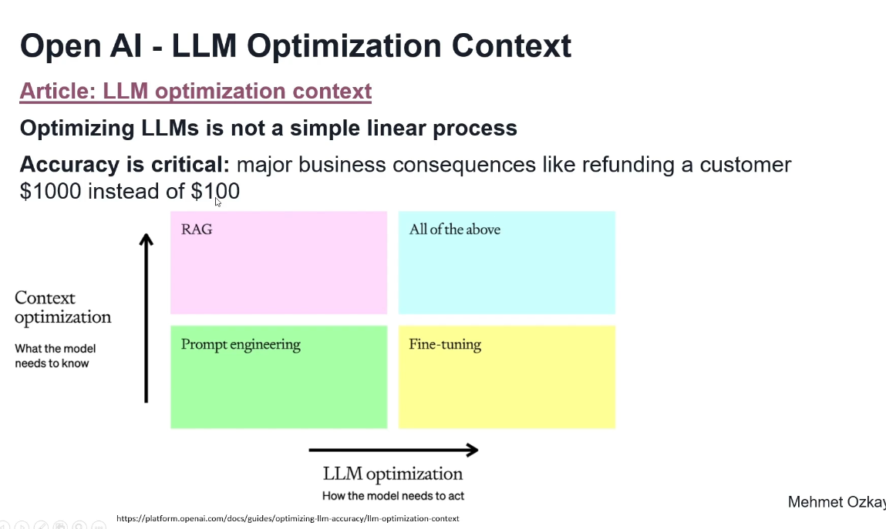
- 

## Prompt Engineering
- 
- 
- 
- 
- 
- 
- 
- 
- 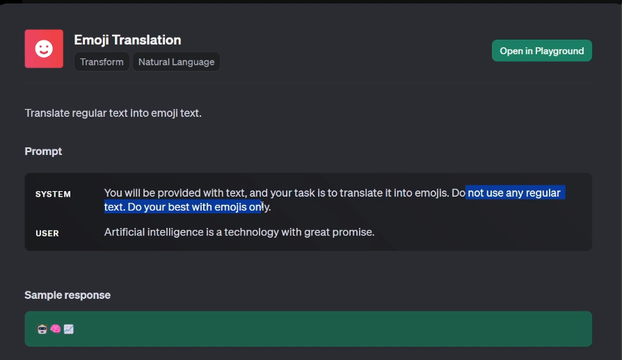
- 
- 
- 
- 
- Better prompts get more accurate and relevant responses and allow us to shape the model's behavior
- Better prompts reduce vague or incorrect outputs by clarifying our instructions.
- Types of prompts: Zero Shot, Few shot and One-Shot
- 

### Steps of Designing Effective Prompts
- 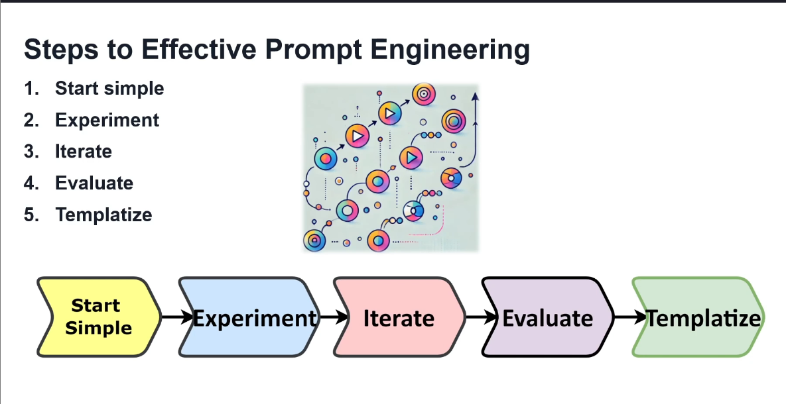
- 
- 
- 
- 
- 
- 
- 
- 
- Zero Shot prompting works well for general topics, but not for complex reasoning or specific data.
- 
- 
- 
- 
- 
- 
- 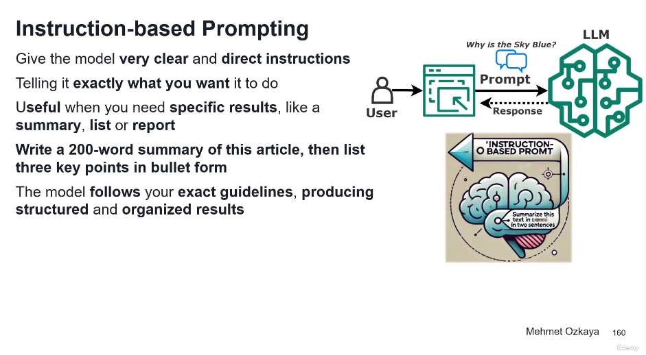
- 
- 
- 
- 
- Example of contextual prompting
- 

### Design Advanced Prompts for EShop Support- Classification, Sentiment Analysis
- 
- 
- We can design an advanced prompt like this:
- You are an AI assistant integrated into an EShop support system. 
Your task is to help support agents by summarizing customer support interactions, classifying the ticket type, and evaluating customer sentiment based on the messages exchanged.

Here are the details of a customer support ticket:

- Product: {{product.Model}}
- Brand: {{product.Brand}}
- Ticket Messages: {{ticket.Messages}}

Please perform the following tasks:

1. **Summarization**: Write a detailed summary (up to 30 words) that includes:
    - The current status of the ticket.
    - Any specific questions asked by the customer.
    - What type of response would be most useful from the next support agent.
    - Avoid repeating the product or customer name unless necessary.

2. **Ticket Classification**: Based on the message log, classify the ticket into one of the following categories:
    - Question, Complaint, Feedback, Request for Refund, Product Issue, Other.
    - If the ticket contains multiple categories, choose the most dominant one.

3. **Customer Sentiment Analysis**: Analyze the latest message from the customer and determine their satisfaction level. Focus on the emotional tone of the customer, especially in how they express their needs or frustrations. Provide the satisfaction level using one of the following options: 
    - Very Dissatisfied, Dissatisfied, Neutral, Satisfied, Very Satisfied.

Return the output in this structured format (as JSON):
{
  "LongSummary": "string",
  "TicketClassification": "string",
  "CustomerSatisfaction": "string"
}

- 
#### Prompts on Ticket Detail page can be designed as follows:
- Prompt: Q&A chat on the Ticket Detail Page with Retrieval-Augmented Generation and Citations

You are an AI assistant named 'Assistant' responsible for helping customer service agents handle support tickets for EShop specializing in electronics and computers.

The agent is currently handling the following ticket:

- Product: {{ProductId}}
- Customer: {{CustomerName}}
- Ticket summary: {{TicketSummary}}
- Customer's latest message: {{TicketLastCustomerMessage}}

You will be asked a question related to this ticket. When answering product-related questions, Always search the product manual or relevant documentation to ensure accuracy. 

**Citations** are critical in every response. After answering, provide a short, **verbatim** quote from the source to support your reply, using the following format:
- <cite source="manual/document_name">"Exact quote here" (max 10 words)</cite>.

Only include **one citation** per response, and ensure it is directly relevant to the question asked. Your responses should be clear, concise, and professional.


>>>>
Prompt 2: Q&A Chat Response Text Generator for Customer Communication on the Ticket Detail Page

You are an AI assistant helping a customer support team at EShop, and your task is to draft responses that agents can use to communicate with customers. Based on the customer’s latest message and overall sentiment, generate a suggested response that addresses the customer’s issue, provides helpful guidance, and maintains a friendly tone.

Here are the details:

- **Product**: {{product.Model}}
- **Ticket Summary**: {{request.TicketSummary}}
- **Customer's Latest Message**: {{request.TicketLastCustomerMessage}}

Analyze the sentiment of the customer's latest message and adjust the tone of the response accordingly:
- If the customer appears **frustrated**, include a sympathetic tone and offer reassurance.
- If the customer is **satisfied**, reinforce the positive experience and offer further assistance if needed.

Generate a response that meets the following guidelines:
- Address the customer's specific question or issue.
- Provide clear and concise instructions or solutions.
- Offer a friendly closing statement, inviting the customer to reach out if they need further help.

Return the response in this format:
{
  "Response": "string"
}


>>>>>
TEST TICKET DETAIL
>>
Prompt1: Q&A chat on the Ticket Detail Page with Retrieval-Augmented Generation and Citations
User Message: (show json viewer)
{
  "product": {
    "Model": "UltraView 4K Pro",
    "Brand": "VisionMax"
  },
  "request": {
    "TicketLastCustomerMessage": "Can you guide me on how to adjust the color settings for my UltraView 4K Pro? The colors seem off when I switch to HDMI mode."
  }
}

>>
Prompt 2: Q&A Chat Response Text Generator for Customer Communication on the Ticket Detail Page
User Message: (show json viewer) -- Customer Ticket 4: Customer Request for Return Policy
{
  "product": {
    "Model": "AirPro Max Blender",
    "Brand": "KitchenMaster"
  },
  "request": {
    "TicketSummary": "Customer inquiring about the return policy for a recently purchased blender.",
    "TicketLastCustomerMessage": "I bought the AirPro Max Blender two weeks ago, and it’s already malfunctioning. It overheats after just 30 seconds of use. Can I return it for a full refund?"
  }
}
- Provide the system instructions 
- 
- 
- 
- 
- 
- 


## Retrieval Augmented Generation(RAG)
- 
- 
- 
- 
- 
- 
- 
- 
- 
- 
- 
- 

### Ingestion with Embeddings and Vector Search
- 
- 
- 
- 
### Retrieval with ReRanking and Context Query Prompts
- 
- 
- 
- 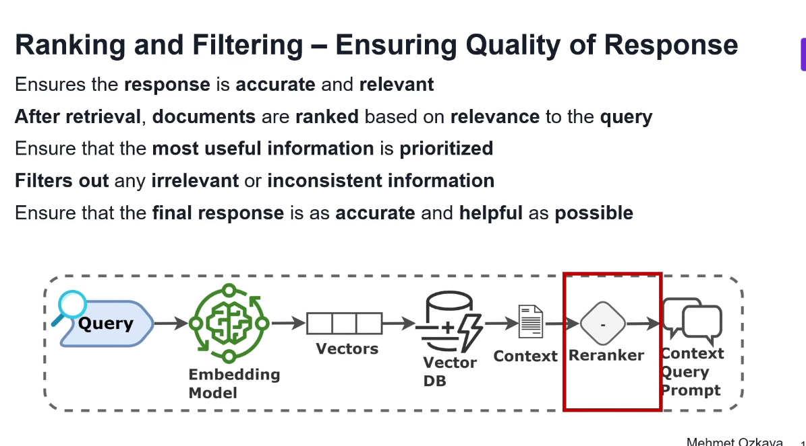
- 
### Generation with Generator and Output 
- 
- 
- 

### E2E Workflow of RAG
- 
- 
- 
- 
- 
- 

### Application Use Cases of RAG
- 
- 
- 
- 

### Challenges and Key considerations of using RAG
- 
- 
- 
- 
  
### Design EShop Customer Support using RAG
- 
- 
- 
- 
- 

## Fine Tuning LLMs
- 
- 
- 
- 

### Why we need Fine Tuning
- 
- 
- 
- 

### When to use Fine Tuning
- 
- 
- 

### How does Fine Tuning Work
- 
- 
- 
- 
- 
- 
- 
- 
- 

### Fine Tuning Methods
- 
- 
- 
- 
- In LORA, small trainable matrices are added to certain layers of the model. These matrices capture the new information needed for the specific task while keeping the rest of the model frozen.
- Because you are only training the edit matrices, the rest of the model remains unchanged.
- This significantly reduces the computational resources needed for fine tuning.
- LORA is particularly useful when you have smaller dataset, but still need to fine tune a model for
a specific task. It allows the model to learn new patterns without overfitting or impacting its general performance.
- Laura has different version, which is the quantized LORA(QLORA)
- QLORA represents a more memory efficient iteration of traditional LORA.
- QLORA takes LORA a step further by also quantizing the weights of the LORA adapters, which is a smaller metrics to the lower precision.
- These further operation reduces the memory footprint and the storage requirements.
- 
- 

### Application and Use Cases of Fine Tuning
- 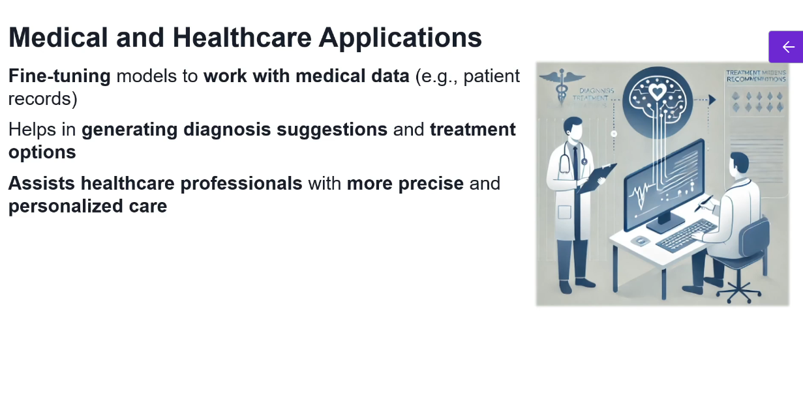
- 
- 

### Challenges and Key Considerations of Fine Tuning
- 
- 
- 
- 
- 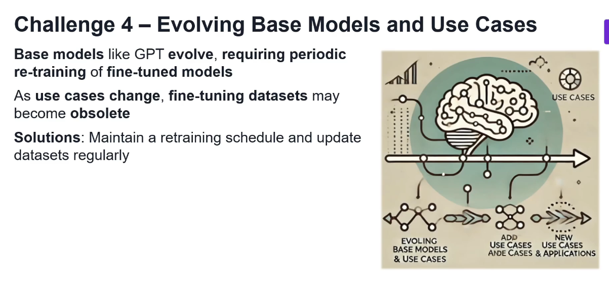

### Design EShop Customer Support using Fine Tuning
- 
- 
- 
- 
- 
- 
- 
- 
- In JSON Lines format, each json object is placed on a single separate line.
- 
- 
- 
- 
- 
- 
- 
- 
- 

## Choosing the Right Optimization
- 
- 
- 
- 
- 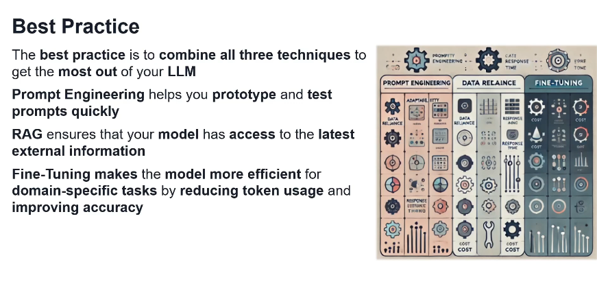
- 
- 

### Training own model for LLM Optimization
- 
- 
- 
- 

## Vector Databases and Semantic Search with RAG
- 
- 
- Vector embeddings allow us to find and retrieve similar objects by searching for objects that are close to each other in the vector space. This concept is called vector search, similarity search, or semantic search.
- As the concept of semantic search is based on the contextual meaning, it allows for a more human-like search experience by retrieving relevant search results that match the user's intent. This advantage makes vector search important for applications, that are e.g., sensitive to typos or synonyms.
- The numerical representation of a data object allows us to apply mathematical operations to them. For example you can calculate the distance between two vector representations to determine their similarity. You can use several similarity measures to calculate the distance between two vectors.
- Squared Euclidean or L2-squared distance calculates the straight-line distance between two vectors. Its range is [0, ∞], where 0 represents identical vectors, and larger values represent increasingly dissimilar vectors.
- Manhattan or L1 distance calculates the sum of the lengths of the projections of the line segment between the points onto the coordinate axes. Its range is [0, ∞], where 0 represents identical vectors, and larger values represent increasingly dissimilar vectors.
- Cosine similarity calculates the cosine of the angle between two vectors. Weaviate uses the cosine distance for the complement of cosine similarity. Its range is [0, 2], where 0 represents identical vectors, and 2 represents vectors that point in opposite directions.
- Dot product calculates the product of the magnitudes of two vectors and the cosine of the angle between them. Its range is [-∞, ∞], where 0 represents orthogonal vectors, and larger values represent increasingly similar vectors. Weaviate uses the negative dot product to keep the intuition that larger values represent increasingly dissimilar vectors.
- 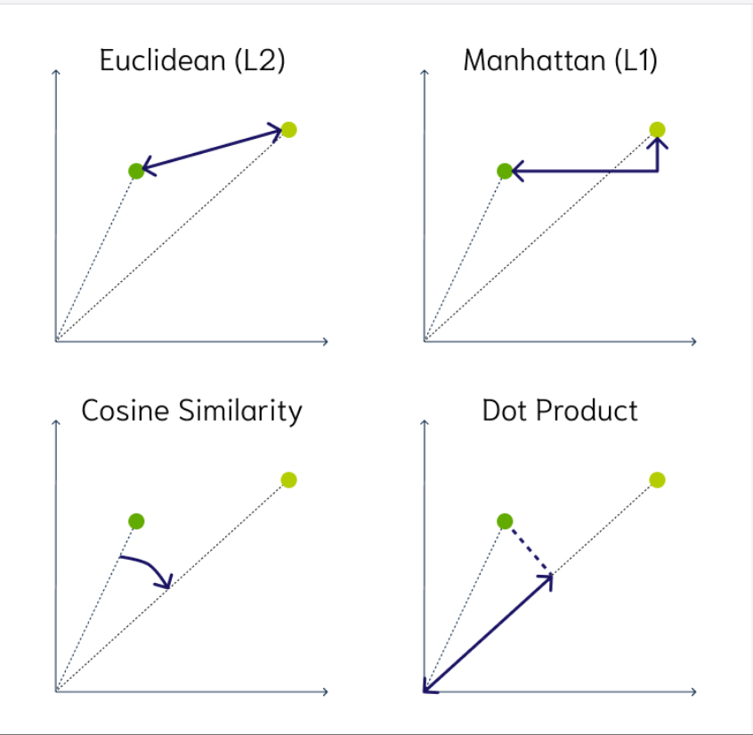
- Vector indexing is the process of organizing vector embeddings so that data can be retrieved efficiently.
- When you want to find the closest items to a given query vector, the brute force approach would be to use the k-Nearest Neighbors (kNN) algorithm. But calculating the similarity between your query vector and every entry in the vector database requires a lot of computational resources, especially if you have large datasets with millions or even billions of data points. This is because the required calculations increase linearly (O(n)) with the dimensionality and the number of data points.
- With the rise of LLMs, many modern Generative AI applications use vector databases as an external knowledge source. You might have already come across the term that they provide LLMs with long-term memory. LLMs are stateless, which means that they immediately forget what you have just discussed if you don’t store this information in, e.g., a vector database and thus provide them with a state. This enables LLMs to hold an actual conversation. Also, you can store additional information in them as part of a retrieval-augmented generation (RAG) pipeline to reduce hallucinations.
- 
- 
- 
- 
- 

### What are Vectors and Vector Embeddings
- 
- 
- 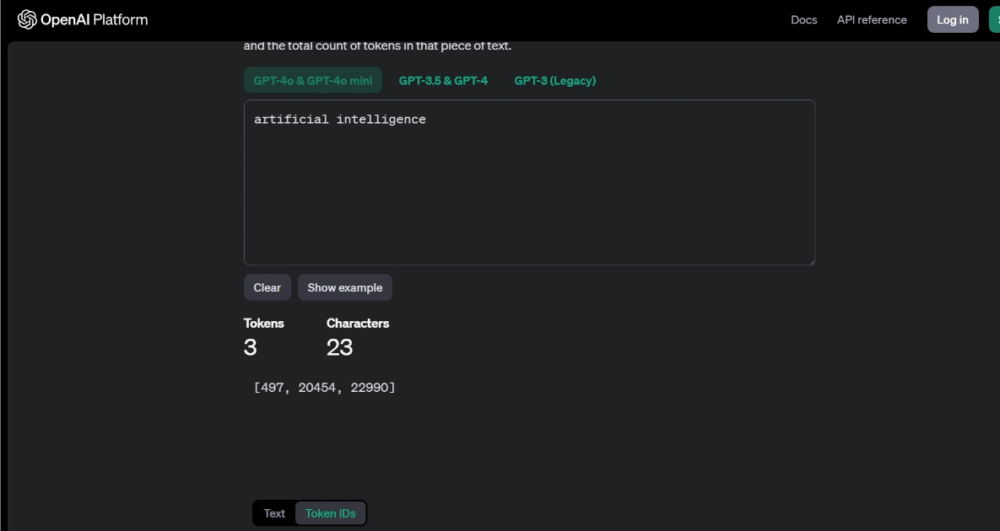
- Now change the word from artificial intelligence to artificial knowledge and observe the generated tokens:
- 
- 

### Explore Vector Embedding Models: OpenAI and Ollama
- These models generate numerical representation of texts which are essential for tasks like semantic
search and recommendation systems.
- 
- 
- An embedding is a vector (list) of floating point numbers. The distance between two vectors measures their relatedness. Small distances suggest high relatedness and large distances suggest low relatedness.
- To get an embedding, send your text string to the embeddings API endpoint along with the embedding model name (e.g., text-embedding-3-small):
```python
from openai import OpenAI
client = OpenAI()

response = client.embeddings.create(
    input="Your text string goes here",
    model="text-embedding-3-small"
)

print(response.data[0].embedding)

```
- The response contains the embedding vector (list of floating point numbers) along with some additional metadata. You can extract the embedding vector, save it in a vector database, and use for many different use cases.
```json
{
  "object": "list",
  "data": [
    {
      "object": "embedding",
      "index": 0,
      "embedding": [
        -0.006929283495992422,
        -0.005336422007530928,
        -4.547132266452536e-05,
        -0.024047505110502243
      ],
    }
  ],
  "model": "text-embedding-3-small",
  "usage": {
    "prompt_tokens": 5,
    "total_tokens": 5
  }
}

```
- By default, the length of the embedding vector is 1536 for text-embedding-3-small or 3072 for text-embedding-3-large. To reduce the embedding's dimensions without losing its concept-representing properties, pass in the dimensions parameter. 
- 
```python
ollama.embed(
  model='mxbai-embed-large',
  input='Llamas are members of the camelid family',
)
```
- Ollama also integrates with popular tooling to support embeddings workflows such as LangChain and LlamaIndex.
- Look at the code for RAG pipeline here: [text](https://ollama.com/blog/embedding-models)
- 
- 
- Observe how it created some many dimensions to capture the meaning of the sentence.
- Similar sentences will have their embeddings close to each other in the vector space.

### Semantic Meaning and Similarity Search
- 
- 
- 
- 
- 
- 


### How Vector Databases Work?
- 
- Data is transformed into vector embeddings using an embedding model, and we will continue with the
vector indexing once vectors are created.
- Embeddings are organized into structures optimized for efficient retrieval and fast similarity search.
- And after that we will perform vector search.
- When a query is submitted, it is transformed into a vector using the same embedding model and compare
these query vector with the stored embeddings or vector database.
- And after performing similarity search, we send context query prompt to the LLM in order to generate
context aware Responses.
- So you can think of vector database as a matchmaking services.

#### Vector Creation
- 
#### Vector Indexing
- 
#### Vector Search
- 

### Vector Search Algorithms
- 
- 
- 
- 
- 
- 

### Use Cases and Applications of Vector Databases
- 
- 

### Explore Vector Databases
- 
- Pinecone is a fully managed serverless vector database optimized for fast and scalable similarity searches.
- It supports various AI and machine learning applications with its robust infrastructure, and it abstracts away infrastructure management and allowing developers to focus on building applications.
- 
- Key features of the pinecone vector database is real time indexing and querying support.
- Also automatic scaling for large datasets and optimized for approximate nearest neighbor(ANN) search
- Use cases could be including semantic search, which is powering advanced search engines and recommendation systems, which is tailored content or product suggestions.
- 
- Another vector DB is chroma
- Chroma is an open source vector database built for fast prototyping and development, and it is ideal
for developers who need a lightweight and easily deployable solution.
- 
- 
- 
- Weaviate is a schema based vector database designed for managing knowledge graphs and contextual search.
- It provides a graphical interface, making it developer friendly.
- 
- Quadrant is a high performance open source vector database designed for real time application, and
it provides handling large data sets efficiently.
- The key features are payload filters, which combine vector search with structured filters, and it
also provides RESTful and gRPC APIs for flexible integration.
- 
- Milvus is a distributed vector database designed for scalability and high availability.
- The key features of the Milvus database are supporting billion scale data management and GPU accelerated querying for faster performance.
- We can create collection very easily, insert data, search and delete data in using the vector database
from the Milvus.
- Main use cases are multimedia search for retrieving similar images or videos from massive data
sets and also it support IoT applications to analyze sensor data for real time decision making.
- 
- 
-  If you are already invested in PostgreSQL, PG vector allows you to add vector capabilities without switching databases.
-  
-  Regis is a well-known in-memory database, and Redis AI extends its capabilities to include vector search and AI model serving.
-  It is optimized for low latency, high throughput applications, the key features of real time processing and tight integration with AI frameworks like TensorFlow and PyTorch
-  Use cases are real time recommendation and AI powered dashboard to provide semantic search for enterprise analytics.

### Design EShop Support Architecture with LLMs and Vector Databases
- 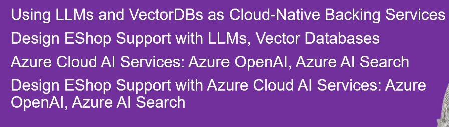
- 
- With the rise of the AI powered technologies, we are entering a new era where large language
models and vector databases can also function as a cloud native backend services.
- These tools provide intelligence, semantic understanding and retrieval capabilities directly embedded
into our applications.
- 
- 
- 
- Tools like semantic Kernel or Link chain bridge the gap between microservices and AI tools, enabling
seamless interactions.
- Integrating Llms and vector databases as a backing services, we can create smarter applications.
- Applications can understand context and provide more accurate and human like responses.
- 
- 
- 
- we need a Glue framework, which is the AI integration component for integrating between
customer support microservices and our AI backing services, includingLLM and vector databases.
- we will integrate with using Semantic Kernel framework for interaction with LLMs.
- Semantic kernel is a glue framework for interacting with LLMS connecting to Ollama.
- We will leverage Ollama for LLM capabilities and embeddings generation and use chroma vector database for semantic search and similarity operations
- All services like LLMs databases and microservices are containerized as a Docker container and run it in the unified Docker network, ensuring robust communication and scalability.
- 
- 
- When support agent send query with Q&A chat window, these requests handled by the customer support microservices and it will integrate with the Ollama LLM embeddings model using the semantic kernel framework in order to create embeddings vector.
- By this way, we can go to the next step, which is the semantic search operation.
- The chroma vector database compares the query embeddings with the stored document embeddings, and it
retrieves the most relevant document chunks, and these chunks form the context needed to answer the query.
- And after that we will create the prompt.
- The customer support microservices combines the retrieved context with the agent's original query into
a structured, context aware prompt.
- So it creates a context aware prompt.
- And after that we will go to the response generation.
- The prompt is sent to the llama 3.2 module in llama, which generates a detailed and contextually accurate responses.
- This response is returned to the front end, enabling the support agent to reply to customer ticket
effectively.
- 
- 
- Alternative to Semantic Kernel is Langchain or LlamaIndex for python developers.
- 


### Azure Cloud AI Services
- 
- Azure OpenAI brings large language models to the enterprise with enterprise grade security scalability and performance.
- 
- 
- 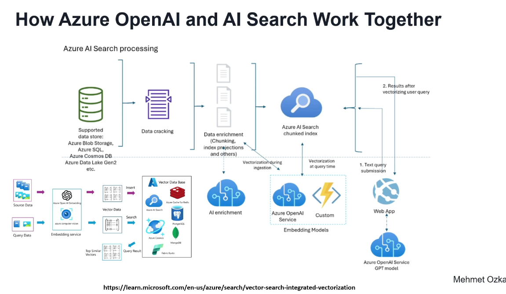
- 
- 
