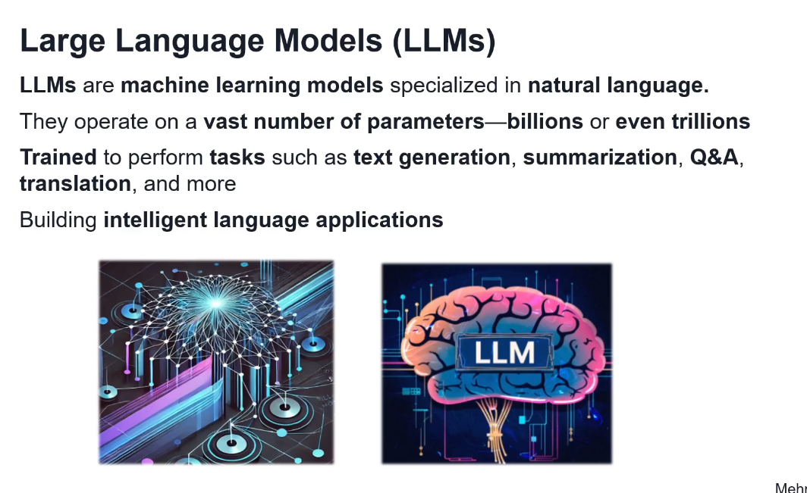
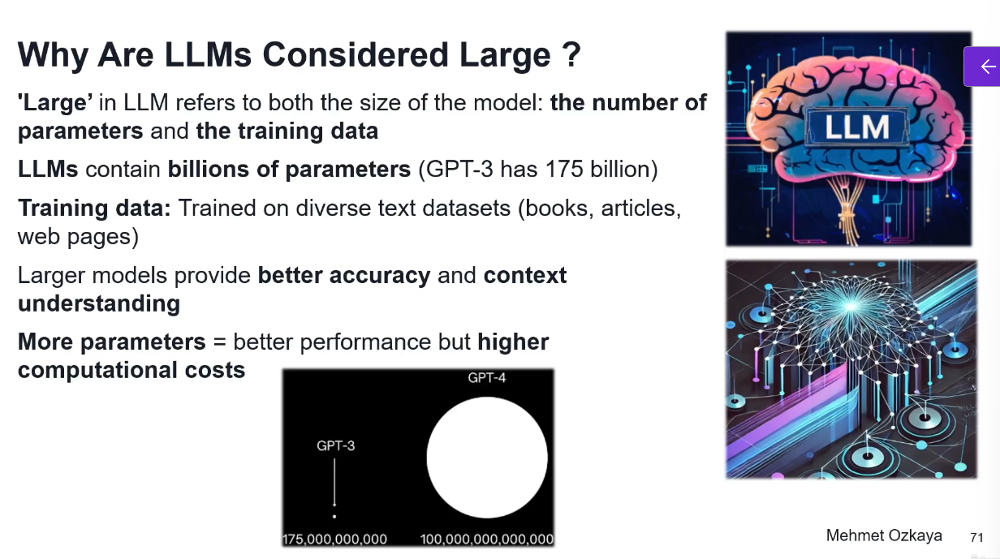
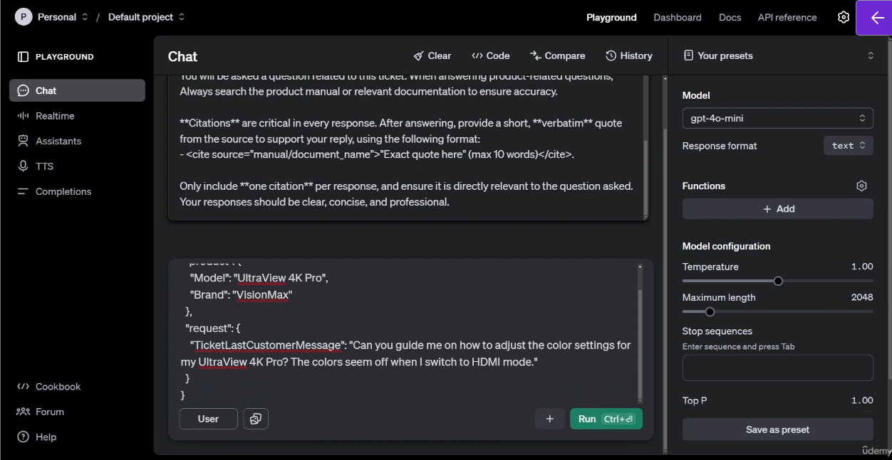
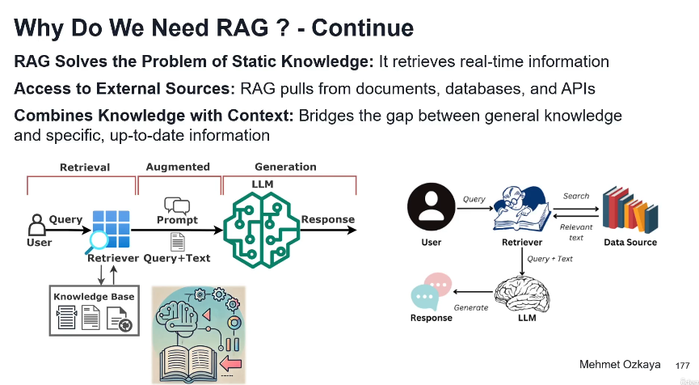

# Generative AI Architectures with LLM, Prompt, RAG, Vector DB

- 
- 
- 
- 
- 
- 
- 
- 
- 
- 

### Overview of EShop Customer Support System
- 
- 

## Generative AI 
- 
- 
- 
- 
- 
- 

### What is Generative AI
- 
- 
- 
- For example, in marketing, generative AI can write product descriptions or design unique advertisements at scale.
- In music, it can compose new songs, and in software development it can even help to generate code.
- Generative AI is a breakthrough technology that enables machines to create new content based on what they have learned.

### How Generative AI works
- 
- 
- 
- 
- 
- 

### Types of Generative AI Models
- 
- 
- 
- 
- 

### Transformer Architecture
- 
- 
- 
- 
- For a sentence like "The cat sat on the mat":
- When processing "cat," self-attention figures out how much focus to put on "The," "sat," "on," "the," and "mat" to understand "cat" better.
- It assigns attention scores to each word based on their relevance.
- Self-attention uses three vectors for each input token: Query (Q), Key (K), and Value (V). These are derived from the input embeddings via learned linear transformations.
- Self-attention is like a smart voting system: each word asks, "Who’s important to me?" (Query), checks "Who matches?" (Key), and builds a new meaning (Value) based on the answers—all in one go.
- 

## What are Large Language Models(LLMs)
- 
- 
- 

### How LLMs work?
- 
- 
- 
- 
- 
- 

### What is Token?
- 
#### What is Tokenization ?
- 
- 
- 

#### How LLMs use Tokens?
- 
- 
- 

#### Capabilities of LLMs
- 
- 
- LLMs can analyze social media, post product reviews, or survey responses in order to determine overall customer sentiment.
- Instead of searching for exact phrases, semantic search can find documents or articles related to a query based on meaning, even if the words don't exactly match.
- This is widely used in document retrieval systems and recommendation engines.

#### LLM Use Cases and Real-World Applications
- 
- 

#### Limitations of LLMs
- 
- 

#### LLM Settings
- 
#### Temperature
- The temperature setting controls how creative or random the model's response will be. It determines the degree of uncertainty in the model's choice.
- So if you select the lower level of the temperature, that makes the model response more focused, predictable and deterministic.
- And this is ideal for tasks where you want to accuracy like math problems or factual answers.
- But when you select a higher temperature, that makes the model more creative and diverse in its response.
- And this is useful for generating creative content like story writing or poetry.
#### Max Tokens: 
- This will be also called max length into the R, OpenAI playground and max tokens defines the maximum number of tokens that the model can generate.
- This is important because it directly impacts how long the response will be.
- For example, if you make this maximum length, a higher level, higher max token allows the model produce longer responses, which is useful for tasks like generating article or detailed summaries.
- And if you go back to lower values and restrict the response to shorter outputs, which can be helpful when you want to concise and summarize answers.
#### Stop Sequences
- We use stop sequences for specific phrases or characters that tell the model to stop generating text once they are encountered, so this is useful for situations where you want to control the length or structure of the output.
- For example, if you are creating a dialogue, you might set the stop sequence as a user so the model stops after reach the response and does not continue the conversation whenever see the user.

#### Top P:
- Top P, top P, or nucleus sampling control the diversity of the model's output by limiting the token choices to a certain probability range.
- So top p 1.0 means that the model considered all possible tokens.
- If you decrease the top p, for example, 0.5 limits, and this will limit the model to the top 50% of the most likely tokens, which can reduce the randomness and make the output more focused.
- So, for example, you can write the prompt as a write poem about the ocean, and if you provide the top p 1.0 will allow the more creative freedom Or if you decrease, the top p will result more precise and less varied output.

#### Frequency Penalty an Presence Penalty: 
- So basically frequency penalty is penalize the repeated words and presence penalties encourage the new topics.
- And you can balance repetition and creativity by changing these LLM settings.

### Function Calling in LLMs
- Function calling enables NLP to not just generate responses, but actually trigger external functions or APIs based on the prompt.
- In other words, the model isn't just giving you an answer.
- Instead of that, it is doing something for you.
- So this could include anything from retrieving live data, booking a meeting, or running a calculation.
- 
- 
- 
- 
- 
- 
- 
- 
- 
- 

## Small Language Models(SLMs)
- 
- 
- 


## Exploring and Running LLMs
- 
- 
- 
- 
- 
- 
- 
- 
- 
- 
- 
- 
```python
from openai import OpenAI
client = OpenAI()

completion = client.chat.completions.create(
    model="gpt-4o",
    messages=[
        {
            "role": "user",
            "content": "Write a one-sentence bedtime story about a unicorn."
        }
    ]
)

print(completion.choices[0].message.content)

```
- Response is as follows:
```json
[
    {
        "index": 0,
        "message": {
            "role": "assistant",
            "content": "Under the soft glow of the moon, Luna the unicorn danced through fields of twinkling stardust, leaving trails of dreams for every child asleep.",
            "refusal": null
        },
        "logprobs": null,
        "finish_reason": "stop"
    }
]


```
- In addition to plain text, you can also have the model return structured data in JSON format - this feature is called Structured Outputs.
- You can provide instructions (prompts) to the model with differing levels of authority using message roles.
```python
 from openai import OpenAI
client = OpenAI()

completion = client.chat.completions.create(
    model="gpt-4o",
    messages=[
        {
            "role": "developer",
            "content": "Talk like a pirate."
        },
        {
            "role": "user",
            "content": "Are semicolons optional in JavaScript?"
        }
    ]
)

print(completion.choices[0].message.content)


```
- In .NET we can do it like this:
- We need to add a nuget package: dotnet add openai
```c#
using OpenAI.Chat;

ChatClient client = new(
  model: "gpt-4o", 
  apiKey: Environment.GetEnvironmentVariable("OPENAI_API_KEY")
);

ChatCompletion completion = client.CompleteChat("Say 'this is a test.'");

Console.WriteLine($"[ASSISTANT]: {completion.Content[0].Text}");


```
- If we want the response to be streamed i.e appear as it is being generated we can using OpenAI's CompleteChatStreamingAsync method:
```c#
using OpenAI.Chat;

ChatClient client = new(
  model: "gpt-4o-mini",
  apiKey: Environment.GetEnvironmentVariable("OPENAI_API_KEY")
);

string prompt = "Why is the sky blue?";

await foreach(var message in client.CompleteChatStreamingAsync(prompt))
{
    foreach(var item in message.ContentUpdate)
    {
        Console.Write(item.Text);
    }
}


```
- 
- 
- 
- 
- 

### Interacting with Ollama Models using Code
- 
- 
- We need to install the following packages
```json
  <ItemGroup>
    <PackageReference Include="Microsoft.SemanticKernel" Version="1.44.0" />
    <PackageReference Include="Microsoft.SemanticKernel.Connectors.Ollama" Version="1.44.0-alpha" />
  </ItemGroup>

```
- Here is the program: 
```c#
using Microsoft.SemanticKernel;
using Microsoft.SemanticKernel.ChatCompletion;

var builder = Kernel.CreateBuilder();
builder.AddOllamaChatCompletion("llama3.2:latest", new Uri("http://localhost:11434"));

var kernel = builder.Build();
var chatService = kernel.GetRequiredService<IChatCompletionService>();

var history = new ChatHistory();
history.AddSystemMessage("You are a helpful assistant");

while(true)
{
    Console.Write("You: ");
    var userMessage = Console.ReadLine();

    if(string.IsNullOrEmpty(userMessage))
    {
        break;
    }

    history.AddUserMessage(userMessage);

    var response = await chatService.GetChatMessageContentAsync(history);

    Console.WriteLine($"Bot: {response.Content}");

    history.AddMessage(response.Role, response.Content ?? string.Empty);
}


```
### Modernizing Modern Apps with AI-Powered LLM Capabilities
- 
- 
- 
- 
- 
- 
- 

### LLM Augmentation Flow
- 
- 
- 
- 
- 
- 
- 

## Prompt Engineering
- 
- 
- 
- 
- 
- 
- 
- 
- 
- 
- 
- 
- 
- Better prompts get more accurate and relevant responses and allow us to shape the model's behavior
- Better prompts reduce vague or incorrect outputs by clarifying our instructions.
- Types of prompts: Zero Shot, Few shot and One-Shot
- 

### Steps of Designing Effective Prompts
- 
- 
- 
- 
- 
- 
- 
- 
- 
- Zero Shot prompting works well for general topics, but not for complex reasoning or specific data.
- 
- 
- 
- 
- 
- 
- 
- 
- 
- 
- 
- Example of contextual prompting
- 

### Design Advanced Prompts for EShop Support- Classification, Sentiment Analysis
- 
- 
- We can design an advanced prompt like this:
- You are an AI assistant integrated into an EShop support system. 
Your task is to help support agents by summarizing customer support interactions, classifying the ticket type, and evaluating customer sentiment based on the messages exchanged.

Here are the details of a customer support ticket:

- Product: {{product.Model}}
- Brand: {{product.Brand}}
- Ticket Messages: {{ticket.Messages}}

Please perform the following tasks:

1. **Summarization**: Write a detailed summary (up to 30 words) that includes:
    - The current status of the ticket.
    - Any specific questions asked by the customer.
    - What type of response would be most useful from the next support agent.
    - Avoid repeating the product or customer name unless necessary.

2. **Ticket Classification**: Based on the message log, classify the ticket into one of the following categories:
    - Question, Complaint, Feedback, Request for Refund, Product Issue, Other.
    - If the ticket contains multiple categories, choose the most dominant one.

3. **Customer Sentiment Analysis**: Analyze the latest message from the customer and determine their satisfaction level. Focus on the emotional tone of the customer, especially in how they express their needs or frustrations. Provide the satisfaction level using one of the following options: 
    - Very Dissatisfied, Dissatisfied, Neutral, Satisfied, Very Satisfied.

Return the output in this structured format (as JSON):
{
  "LongSummary": "string",
  "TicketClassification": "string",
  "CustomerSatisfaction": "string"
}

- 
#### Prompts on Ticket Detail page can be designed as follows:
- Prompt: Q&A chat on the Ticket Detail Page with Retrieval-Augmented Generation and Citations

You are an AI assistant named 'Assistant' responsible for helping customer service agents handle support tickets for EShop specializing in electronics and computers.

The agent is currently handling the following ticket:

- Product: {{ProductId}}
- Customer: {{CustomerName}}
- Ticket summary: {{TicketSummary}}
- Customer's latest message: {{TicketLastCustomerMessage}}

You will be asked a question related to this ticket. When answering product-related questions, Always search the product manual or relevant documentation to ensure accuracy. 

**Citations** are critical in every response. After answering, provide a short, **verbatim** quote from the source to support your reply, using the following format:
- <cite source="manual/document_name">"Exact quote here" (max 10 words)</cite>.

Only include **one citation** per response, and ensure it is directly relevant to the question asked. Your responses should be clear, concise, and professional.


>>>>
Prompt 2: Q&A Chat Response Text Generator for Customer Communication on the Ticket Detail Page

You are an AI assistant helping a customer support team at EShop, and your task is to draft responses that agents can use to communicate with customers. Based on the customer’s latest message and overall sentiment, generate a suggested response that addresses the customer’s issue, provides helpful guidance, and maintains a friendly tone.

Here are the details:

- **Product**: {{product.Model}}
- **Ticket Summary**: {{request.TicketSummary}}
- **Customer's Latest Message**: {{request.TicketLastCustomerMessage}}

Analyze the sentiment of the customer's latest message and adjust the tone of the response accordingly:
- If the customer appears **frustrated**, include a sympathetic tone and offer reassurance.
- If the customer is **satisfied**, reinforce the positive experience and offer further assistance if needed.

Generate a response that meets the following guidelines:
- Address the customer's specific question or issue.
- Provide clear and concise instructions or solutions.
- Offer a friendly closing statement, inviting the customer to reach out if they need further help.

Return the response in this format:
{
  "Response": "string"
}


>>>>>
TEST TICKET DETAIL
>>
Prompt1: Q&A chat on the Ticket Detail Page with Retrieval-Augmented Generation and Citations
User Message: (show json viewer)
{
  "product": {
    "Model": "UltraView 4K Pro",
    "Brand": "VisionMax"
  },
  "request": {
    "TicketLastCustomerMessage": "Can you guide me on how to adjust the color settings for my UltraView 4K Pro? The colors seem off when I switch to HDMI mode."
  }
}

>>
Prompt 2: Q&A Chat Response Text Generator for Customer Communication on the Ticket Detail Page
User Message: (show json viewer) -- Customer Ticket 4: Customer Request for Return Policy
{
  "product": {
    "Model": "AirPro Max Blender",
    "Brand": "KitchenMaster"
  },
  "request": {
    "TicketSummary": "Customer inquiring about the return policy for a recently purchased blender.",
    "TicketLastCustomerMessage": "I bought the AirPro Max Blender two weeks ago, and it’s already malfunctioning. It overheats after just 30 seconds of use. Can I return it for a full refund?"
  }
}
- Provide the system instructions 
- 
- 
- 
- 
- 
- 


## Retrieval Augmented Generation(RAG)
- 
- 
- 
- 
- 
- 
- 
- 
- 
- 
- 
- 

### Ingestion with Embeddings and Vector Search
- 
- 
- 
- 
### Retrieval with ReRanking and Context Query Prompts
- 
- 
- 
- 
- 
### Generation with Generator and Output 
- 
- 
- 

### E2E Workflow of RAG
- 
- 
- 
- 
- 
- 

### Application Use Cases of RAG
- 
- 
- 
- 

